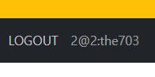

sec:authentication="principal.username" 
 -- 로그인 성공하면 사용자 닉네임 같이 보여짐

ufile은 file의 경로만 보여지는거고 파일은 name=file

2. 상세 비교

### 🔍 GET 방식: "데이터 좀 보여줘" (Read)
특징: 주소창에 데이터가 그대로 노출됩니다. 예를 들어 검색창에 '사과'를 검색하면 URL 뒤에 ?search=사과 같은 식으로 붙는 방식입니다.

장점: 내가 검색한 결과 페이지를 다른 사람에게 링크(URL)로 공유하거나, 브라우저 즐겨찾기(북마크)에 등록할 수 있습니다. 컴퓨터가 결과를 기억(캐싱)해 두기 때문에 속도도 빠릅니다.

1) 주의점: 주소창에 값이 다 보이기 때문에 로그인 비밀번호, 주민등록번호 같은 민감한 정보를 GET으로 보내면 절대 안 됩니다.

### POST 방식: "이 데이터 처리해줘" (Create / Update / Delete)
특징: 데이터를 택배 상자(HTTP Body) 안에 숨겨서 보냅니다. 주소창에는 그냥 /users/join처럼 깔끔하게 주소만 남습니다.

장점: 겉으로 데이터가 드러나지 않으며, 글자 수 제한이 없어서 용량이 큰 이미지, 동영상 파일을 서버로 업로드할 때 필수적입니다.

1) 주의점: URL에 데이터가 없기 때문에 '글쓰기 완료 화면'이나 '결제 완료 화면'을 즐겨찾기 하거나 링크로 공유할 수 없습니다. (새로고침을 누르면 "데이터를 다시 제출하시겠습니까?"라는 경고창이 뜨는 이유가 바로 이 때문입니다.)

💡 보안 주의사항 (A peer's advice)
종종 "POST는 안 보이니까 안전하고, GET은 위험하다"고 오해하는 경우가 있습니다. 하지만 POST도 개발자 도구를 열어보면 본문(Body) 내용을 다 들여다볼 수 있습니다. 따라서 진짜 보안이 중요할 때는 GET/POST의 차이가 아니라, 통신 자체를 암호화하는 HTTPS를 적용해야 합니다.

